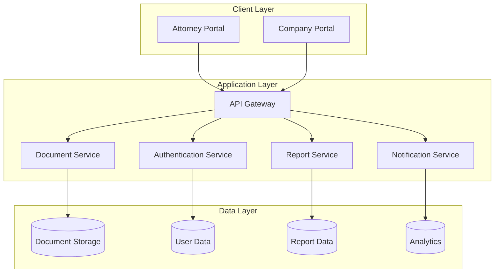
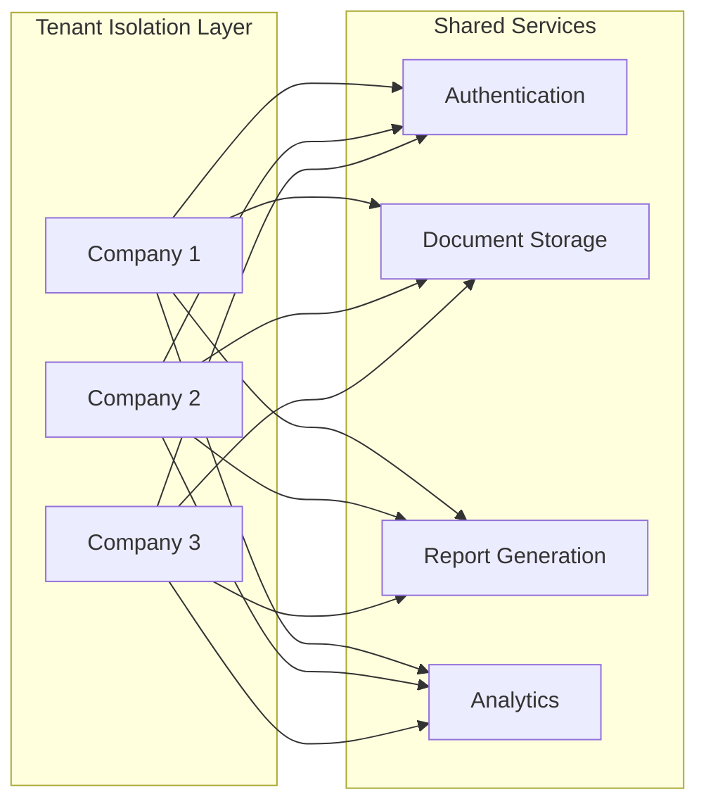
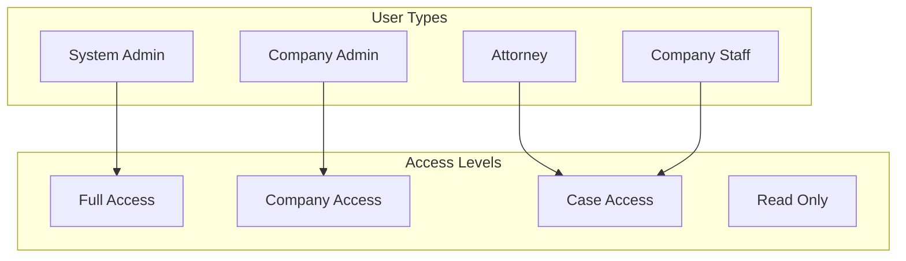
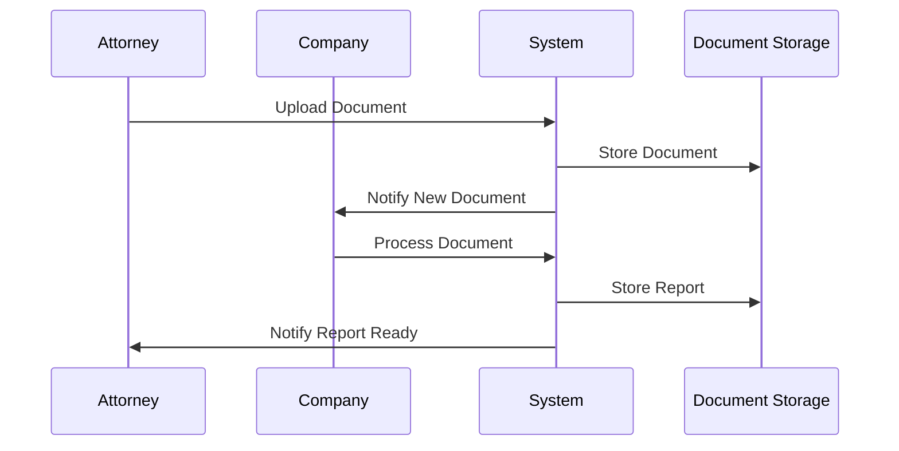
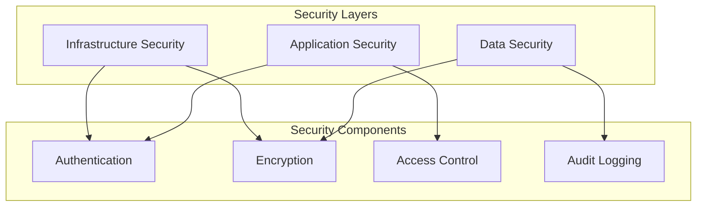

# Aspen Grove Services - System Architecture

## 1. High-Level System Overview



## 2. Multi-Tenant Architecture



## 3. User Roles and Access



## 4. Data Flow



## 5. Security Architecture



## 6. Component Details

### 6.1 Attorney Portal Components
- Document Management
- Case Tracking
- Report Requests
- Billing & Payments
- Legal Resources
- Communication System

### 6.2 Company Portal Components
- Client Management
- Report Generation
- Team Management
- Billing & Invoicing
- Analytics & Reporting
- Service Configuration

### 6.3 Shared Components
- Authentication Service
- Document Storage Service
- Notification Service
- API Gateway
- Analytics Service

## 7. Database Schema (High Level)

### 7.1 User Management
```sql
Users
- id
- email
- role
- company_id
- created_at
- updated_at

Companies
- id
- name
- settings
- created_at
- updated_at

Permissions
- id
- role
- resource
- action
```

### 7.2 Document Management
```sql
Documents
- id
- company_id
- case_id
- type
- status
- created_at
- updated_at

Cases
- id
- company_id
- attorney_id
- status
- created_at
- updated_at
```

### 7.3 Report Management
```sql
Reports
- id
- case_id
- type
- status
- created_at
- updated_at

ReportTemplates
- id
- company_id
- type
- content
- created_at
- updated_at
```

## 8. API Endpoints

### 8.1 Authentication
- POST /auth/login
- POST /auth/register
- POST /auth/logout
- GET /auth/profile

### 8.2 Documents
- POST /documents/upload
- GET /documents/{id}
- GET /documents/case/{caseId}
- PUT /documents/{id}

### 8.3 Reports
- POST /reports/generate
- GET /reports/{id}
- GET /reports/case/{caseId}
- PUT /reports/{id}

### 8.4 Cases
- POST /cases
- GET /cases/{id}
- GET /cases/company/{companyId}
- PUT /cases/{id}

## 9. Implementation Phases

### Phase 1: Foundation (1-2 months)
- Basic infrastructure setup
- Authentication system
- Document storage
- Basic portals

### Phase 2: Core Features (2-3 months)
- Report generation
- Case management
- Billing system
- Basic analytics

### Phase 3: Advanced Features (3-4 months)
- Advanced analytics
- Custom workflows
- Additional services
- Enhanced security

## 10. Security Considerations

### 10.1 Data Protection
- HIPAA compliance
- Data encryption
- Access control
- Audit logging

### 10.2 Infrastructure Security
- AWS security groups
- Network isolation
- Regular backups
- Disaster recovery

### 10.3 Application Security
- Input validation
- XSS protection
- CSRF protection
- Rate limiting

## 11. Monitoring and Maintenance

### 11.1 System Monitoring
- Performance metrics
- Error tracking
- Usage analytics
- Security monitoring

### 11.2 Maintenance
- Regular updates
- Security patches
- Backup verification
- Performance optimization

## 12. Scaling Strategy

### 12.1 Horizontal Scaling
- Load balancing
- Database sharding
- Cache implementation
- CDN integration

### 12.2 Vertical Scaling
- Resource optimization
- Database optimization
- Code optimization
- Infrastructure upgrades 