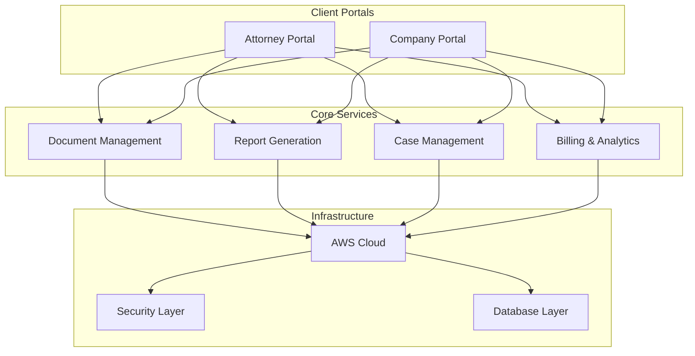
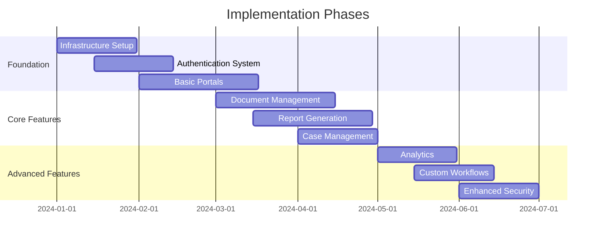
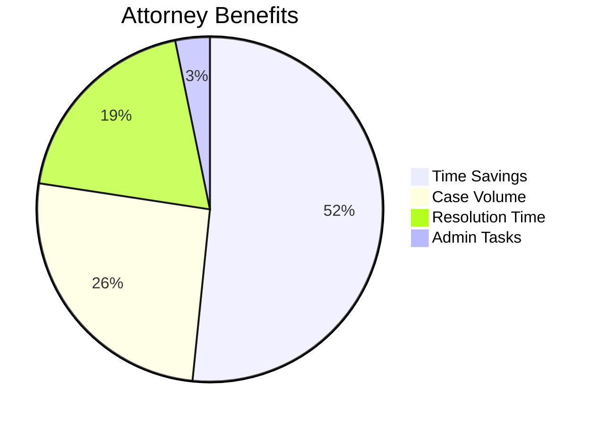
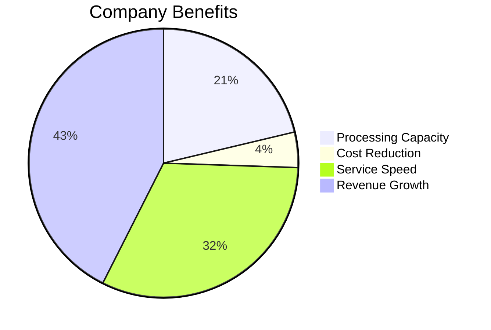

# Aspen Grove Services - Complete System Overview

## 1. System Architecture Overview

## 2. Value Proposition Matrix

### For Attorneys
| Feature | Benefit | Impact |
|---------|---------|---------|
| Instant Access | Single platform access | 80% time reduction |
| Automated Processing | Streamlined workflow | 40% more cases |
| Quick Turnaround | Faster service | 30% faster resolution |
| Scalable Operations | Growth without overhead | $10K monthly savings |

### For Companies
| Feature | Benefit | Impact |
|---------|---------|---------|
| Automated Processing | Increased capacity | 200% more reports |
| 24/7 Availability | Continuous operation | 3x faster service |
| Market Expansion | New client acquisition | $50K monthly growth |
| Service Diversification | New revenue streams | 400% annual ROI |

## 3. Implementation Timeline

## 4. Key Performance Indicators

### Attorney Metrics

### Company Metrics

## 5. System Components

### 5.1 Attorney Portal
- Document Management
- Case Tracking
- Report Requests
- Billing & Payments
- Legal Resources
- Communication System

### 5.2 Company Portal
- Client Management
- Report Generation
- Team Management
- Billing & Invoicing
- Analytics & Reporting
- Service Configuration

### 5.3 Shared Infrastructure
- Authentication Service
- Document Storage
- Notification System
- API Gateway
- Analytics Engine

## 6. Security & Compliance

### 6.1 Data Protection
- HIPAA Compliance
- End-to-End Encryption
- Access Control
- Audit Logging

### 6.2 Infrastructure Security
- AWS Security Groups
- Network Isolation
- Regular Backups
- Disaster Recovery

## 7. Business Impact

### 7.1 For Attorneys
- 80% reduction in document handling
- 40% increase in case capacity
- 30% faster case resolution
- $10,000 monthly savings

### 7.2 For Companies
- 200% processing capacity increase
- 40% operational cost reduction
- 3x faster service delivery
- $50,000 monthly revenue growth

## 8. Future Roadmap

### Phase 1 (Q1 2024)
- Basic infrastructure
- Core portals
- Essential features

### Phase 2 (Q2 2024)
- Advanced analytics
- Custom workflows
- Enhanced security

### Phase 3 (Q3 2024)
- AI integration
- Advanced reporting
- Market expansion

## 9. Success Metrics

### 9.1 Performance Indicators
- System uptime: 99.9%
- Report generation time: < 24 hours
- User satisfaction: > 95%
- Cost reduction: 40%

### 9.2 Business Metrics
- Revenue growth: 200%
- Client retention: 95%
- Market expansion: 3x
- ROI: 300-400%

## 10. Support & Maintenance

### 10.1 Technical Support
- 24/7 system monitoring
- Automated backups
- Regular updates
- Performance optimization

### 10.2 Business Support
- Client onboarding
- Training programs
- Documentation
- Best practices 